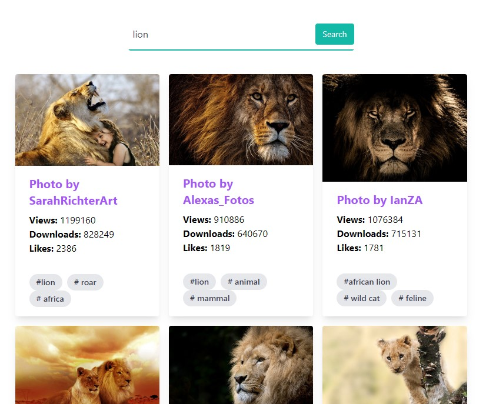

# Image Search Web App



This is a simple web application that allows users to search for images using a keyword or term. It leverages the Pixabay API to fetch and display images related to the user's search term.

## Skills Showcased

This project showcases several skills and concepts in web development, including:

1. **React**: The project is built using the React library, demonstrating the ability to create reusable and interactive components.

2. **React State Management**: State management in React is demonstrated through the use of the `useState` hook. It manages the state of the image data, loading indicator, and search term.

3. **React useEffect Hook**: The `useEffect` hook is used for making asynchronous API requests when the search term changes. This showcases the ability to handle side effects in a React application.

4. **API Integration**: The project fetches image data from the Pixabay API, showcasing the ability to integrate external APIs into a web application.

5. **Conditional Rendering**: Conditional rendering is used to display loading indicators and messages when no images are found based on the API response.

6. **Form Handling**: The search form in the `ImageSearch` component demonstrates form handling in React, capturing user input and triggering a search.

7. **CSS Styling**: The project uses Tailwind CSS for styling, demonstrating the ability to apply styles and create a visually appealing user interface.

## How to Run

To run this project locally, follow these steps:

1. Clone the repository to your local machine.

2. Install the required dependencies by running:

   ```
   npm install
   ```

3. Create a `.env` file in the project root and add your Pixabay API key like this:

   ```
   REACT_APP_PIXABAY_API_KEY=YOUR_API_KEY_HERE
   ```

   Replace `YOUR_API_KEY_HERE` with your actual Pixabay API key.

4. Start the development server:

   ```
   npm start
   ```

   This will launch the application in your default web browser.

## Usage

1. Enter a search term in the search input field and press the "Search" button.

2. Images related to your search term will be displayed in a responsive grid.

3. You can view details about each image, including the photographer's name, views, downloads, likes, and tags.

4. Enjoy exploring and searching for images!

## Credits

- This project is built with [Tailwind CSS](https://tailwindcss.com/).
- This poject is based on a tutorial by [Brad Traversy](https://www.youtube.com/watch?v=FiGmAI5e91M&ab_channel=TraversyMedia).

